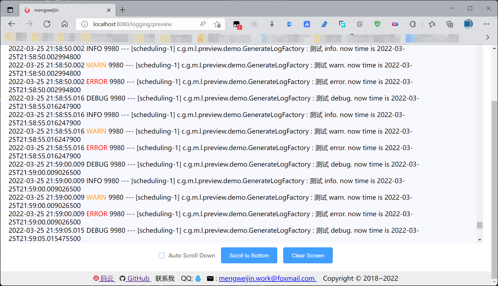

# logging-preview-spring-boot-starter

<p align="center">	
	<a target="_blank" href="https://search.maven.org/search?q=g:%22com.github.mengweijin%22%20AND%20a:%22logging-preview-spring-boot-starter%22">
		
	</a>
	<a target="_blank" href="https://github.com/mengweijin/logging-preview-spring-boot-starter/blob/master/LICENSE">
		
	</a>
	<a target="_blank" href="https://www.oracle.com/technetwork/java/javase/downloads/index.html">
		
	</a>
	<a target="_blank" href="https://gitee.com/mengweijin/logging-preview-spring-boot-starter/stargazers">
		
	</a>
	<a target="_blank" href='https://github.com/mengweijin/logging-preview-spring-boot-starter'>
		
	</a>
</p>

## Description
用浏览器在线实时刷新预览 SpringBoot 项目的日志，不必再登陆到 Linux 服务器上去查看了。

### 使用
```xml
<dependency>
    <groupId>com.github.mengweijin</groupId>
    <artifactId>logging-preview-spring-boot-starter</artifactId>
    <version>Latest Version</version>
</dependency>
```

```yaml
spring:
  profiles:
    active: dev # 不配置或者配置不为 prod 才生效
logging:
  file:
    name: logs/application.log
  preview:
    # 需要开启生效（并且 spring.profiles.active 不等于 prod 才生效）
    enabled: true
    # 不配置的话默认从 spring boot 的 logging.file.name 读取（或者 spring boot 低版本从 logging.file 读取。）。
    # path: /usr/local/app/logs/application.log
```

### 在线预览
- 启动你的应用程序
- 浏览器访问 http://{ip}:{port}/logging/preview 即可实时查看日志。


