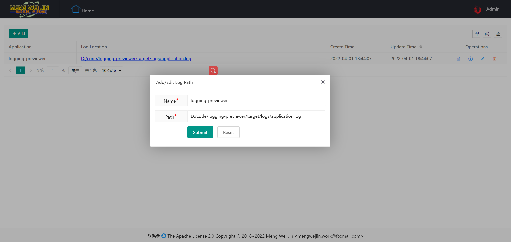

# logging-previewer

<p align="center">
    <a target="_blank" href="https://search.maven.org/search?q=g:%22com.github.mengweijin%22%20AND%20a:%22logging-previewer%22">
		
	</a>
	<a target="_blank" href="https://github.com/mengweijin/logging-preview-spring-boot-starter/blob/master/LICENSE">
		
	</a>
	<a target="_blank" href="https://www.oracle.com/technetwork/java/javase/downloads/index.html">
		
	</a>
	<a target="_blank" href="https://gitee.com/mengweijin/logging-previewer/stargazers">
		
	</a>
	<a target="_blank" href='https://github.com/mengweijin/logging-previewer'>
		
	</a>
</p>

## Description
用浏览器在线实时刷新预览和下载 SpringBoot 项目的日志，不必再登陆到 Linux 服务器上去查看了。

有些服务器使用动态密码（比如半小时密码就过期了），每次都要去专门的平台查看密码，再连接服务器查看应用日志，非常繁琐。

### 使用
在这里下载 fat jar：[logging-previewer-{version}-alpha.jar](https://gitee.com/mengweijin/logging-previewer/releases/)
并上传到要查看日志的应用部署的服务器上。

或者从 maven 中央仓库下载 fat jar:
```xml
<dependency>
    <groupId>com.github.mengweijin</groupId>
    <artifactId>logging-previewer</artifactId>
    <version>1.0.0-alpha</version>
</dependency>
```

```bash
# 启动
java -jar logging-previewer-{version}-alpha.jar

# 然后浏览器访问：http://IP:9999
```

添加你的应用日志文件路径到 logging-previewer：



### 预览


